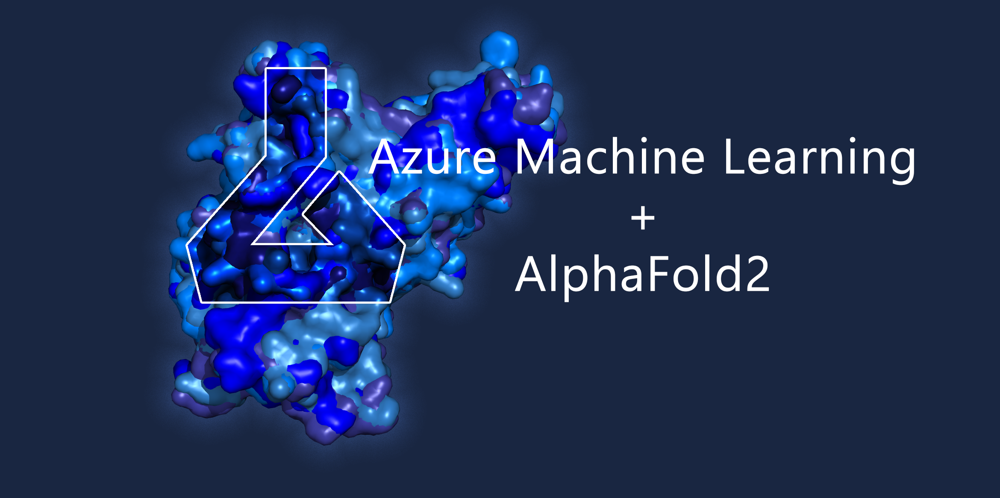

# Running AlphaFold2 (from ColabFold) in Azure Machine Learning

<h3 align="right">Colby T. Ford, Ph.D.</h3>




- Companion repository for Medium Post: [How to predict many protein structures with AlphaFold2 at-scale in Azure Machine Learning](https://colbyford.medium.com/how-to-predict-many-protein-structures-with-alphafold2-at-scale-in-azure-machine-learning-c1e0ece4e99f).

## Resources:
- Jupyter Notebook: [AzureML_AlphaFold2_HyperDrive.ipynb](AzureML_AlphaFold2_HyperDrive.ipynb)
- Sample Sequence FASTA: [sequences.fasta](sequences.fasta)
- Dockerfile: [Dockerfile](Dockerfile)


### Docker Image Creation

The custom Docker image for running ColabFold in Azure ML HyperDrive is available on Docker Hub at https://hub.docker.com/r/cford38/alphafold2_aml. If you'd like to build the image for yourself, follow the instructions below.

First, build the custom Azure ML Docker image (with the required dependencies for the AlphaFold2 system).
```sh
docker build -t alphafold2_aml --build-arg IMAGE_VERSION=$(git rev-parse --short HEAD) .

# docker run --name alphafold2_aml --rm -p 8787:8787 alphafold2_aml
# docker exec -it alphafold2_aml /bin/bash
```

To push the image to DockerHub, run the following:
(If you'd like to use Azure Container Registry, see [this documentation](https://docs.microsoft.com/en-us/azure/container-registry/container-registry-get-started-docker-cli?tabs=azure-cli).)
```sh
docker image tag alphafold2_aml <USERNAME>/alphafold2_aml:latest
docker push <USERNAME>/alphafold2_aml:latest

# docker image tag alphafold2_aml cford38/alphafold2_aml:latest
# docker push cford38/alphafold2_aml:latest
```

To push the image to an Azure Container Registry, run the following:
```sh
az login
az account set --subscription <SUBSCRIPTION_ID>

az acr login --name <CONTAINER_REGISTRY_NAME>

docker tag mmae_aml <CONTAINER_REGISTRY_NAME>.azurecr.io/alphafold2_aml:$(git rev-parse --short HEAD)
docker push <CONTAINER_REGISTRY_NAME>.azurecr.io/alphafold2_aml:$(git rev-parse --short HEAD)
```
